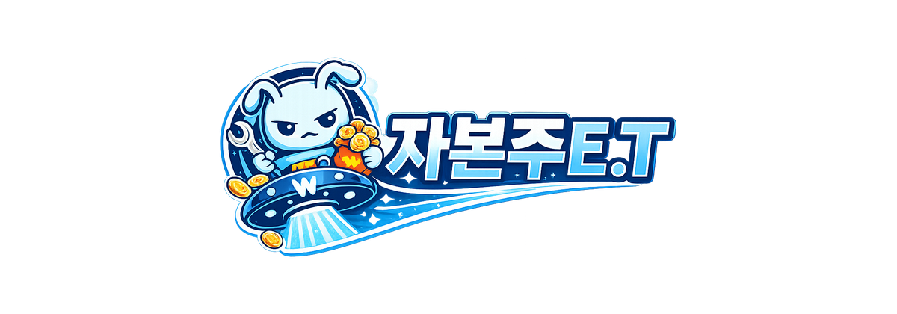

<!-- ===== HEADER ===== -->

   
   
  
  <!-- character -->
  
   

  <!-- title -->
   
 

 

  <!-- nav bar -->

  
  
  
  <!-- options -->

  
   

  
   

  
   

  
   

  
   

 
 

---

 

<!-- ===== ABOUT ME ===== -->

  

 

<!-- ABOUT CONTENT -->

  

  
  
   
  
  안녕하세요! 
  작은 아이디어를 직접 구현하며, 
  새로운 기술을 배우며 성장하고 있습니다 🐹
   
  
  <!-- INTERESTS -->
  
   
  
&nbsp;
  
&nbsp;
  
  
  <!-- LINKS -->
  
   
  
    &nbsp;&nbsp;
  

   

 

---

 

<!-- ===== EDUCATION ===== -->

  

 

<!-- EDUCATION CONTENT -->

  ✦  
  &nbsp;&nbsp;&nbsp;&nbsp;<b>HYUNDAI AI Insight Campus 1st</b> 
  &nbsp;&nbsp;&nbsp;&nbsp;AI Engineering Track 
    
  
  ✦  
  &nbsp;&nbsp;&nbsp;&nbsp;<b>SSAFY 14th</b> 
  &nbsp;&nbsp;&nbsp;&nbsp;Python Track 
   
  
  ✦  
  &nbsp;&nbsp;&nbsp;&nbsp; <b>Chung-Ang Univ.</b> 
  &nbsp;&nbsp;&nbsp;&nbsp; Economics

 

---

 

<!-- ===== PROJECTS ===== -->

  

  

<!-- PROJECTS CONTENT -->

  <!-- project 01 -->
  

    
    <b>MOA</b> 
    
    
    
     
    2025.11 ~ 2025.12 
    
      웨딩 준비에 필요한 일정과 정보를 한곳에서 관리할 수 있는 맞춤형 웨딩 플래너 서비스
    
         
     
  

  

  <!-- project 02 -->
  

    
     
    <b>UNBLUR</b> 
    
    
    
     
    2026.01 ~ 2026.02 
    
      WebRTC 기반 화상 통화와 단계별 블라인드 해제 기능을 결합한 실시간 소개팅 서비스
    
     
     
  

  

  <!-- project 03 -->
  

    
     
    <b>자본주E.T</b> 
    
    
    
     
    2026.02 ~ 2026.04 
    
      경제 개념을 자연스럽게 학습할 수 있도록 제작한 2D 러닝 게임
    
     
     
  

  

  <!-- project 04 -->
  

    
     
    <b>GIFTED</b> 
    
    
    
     
    2026.04 ~ 2026.06 
    
      플레이어가 주문에 맞춰 제한 시간 내에 선물을 포장하는 싱글 플레이 게임
    
     
     
  

  
  

  <!-- project 05 -->
  

    
     
    <b>제3회 국민대학교 AI빅데이터 분석 경진대회</b> 
     
    정형 · 시계열 · 무역 데이터 기반 분석 
    분류 및 회귀 모델 성능 개선
  

  

  <!-- project 06 -->
  

    
     
    <b>운수종사자 인지 데이터 기반 교통사고 위험 예측</b> 
     
    운수종사자 인지·정형 데이터 기반 교통사고 위험도 예측 모델 개발 
    AUC · Brier Score 기반 평가
  

  

 

---

 

<!-- ===== TOOLKITS ===== -->

  

 

<!-- TOOLKITS CONTENT -->
<table align="center" width="100%">
  <tr>
    <td width="50%">
      <b>Languages</b> 
       
      
      
      
      
      
       
    </td>
    <td width="50%">
      <b>Collaboration / Design</b> 
       
      
      
      
      
      
       
    </td>
  </tr>
  <tr>
    <td width="50%">
      <b>Frontend</b> 
       
      
      
      
      
      
       
    </td>
    <td width="50%">
      <b>Backend</b> 
       
      
      
      
     
    </td>
  </tr>
  <tr>
    <td width="50%">
      <b>Game</b> 
       
      
       
    </td>
    <td width="50%">
      <b>AI / Data</b> 
       
      
      
      
      
      
      
       
    </td>
  </tr>
</table>

 

---

 

<!-- ===== NOWDOING ===== -->

  

  

<!-- NODOING CONTENT -->

  

